# Port Jailhouse to AGL

# *Walkthrough

We use AGL as the main OS to install a hypervisor on an AGL reference platform.

We can then partition the CPU using that hypervisor.

This hypervisor will give the RTOS a virtual operating platform.

This is where the Jailhouse hypervisor becomes a core part of the project.

The RTOS running as guest on the hypervisor can then procure data in real time and communicate it with the AGL OS.

Download the AGL master branch

Run the following commands consecutively in the directory
Where you want to build the AGL OS

	$ mkdir AGL
	$ cd AGL
	$ repo init -u https://gerrit.automotivelinux.org/gerrit/AGL/AGL-repo
	$ repo sync

You can click here to get a more verbose guide to cloning AGL:
## *SOURCE CODE
https://wiki.automotivelinux.org/agl-distro/source-code

Create the Build Directory

To build the QEMU version of the AGL OS with the Jailhouse hypervisor

Run the following command, it will build a directory where all the work specific to that
build will be stored.

	$ source /meta-agl/scripts/aglsetup.sh -m qemux86-64 -b build-dir-name agl-demo agl-devel agl-jailhouse

	##this will automotically change the directory to the build-dir-name/  
	##structure of this direct-tree :)
	##.
	##├── agl-init-build-env
	##├── aglsetup.manifest
	##└── conf
	####    ├── bblayers.conf
	####    ├── fragments.log
	####    ├── local.conf
	####    ├── setup.log
	####    └── templateconf.cfg

The following are features and why they are used:  

agl-demo: enable layer meta-agl-demo and meta-qt5 - required to build agl-demo-platform  

agl-devel: activate development options (empty root password, debugger, strace, valgrind …)

agl-jailhouse : enable layer meta-agl-jailhouse , required to build the out-of-kernel Jailhouse module  

source this script to be able to start bit-baking(or in fancy words, to initialize the build environment)

	$ source agl-init-build-dev

    Common targets are:
    - meta-agl layer:
    - included by default
        * agl-image-boot                (just enough to boot)
	* agl-image-minimal             (minimal filesystem with APIs)
	* agl-image-minimal-crosssdk    (crosssdk for ^^)

    - with 'agl-profile-graphical'
	* agl-image-weston              (minimal filesystem with weston)

    - with 'agl-profile-graphical-qt5'
	* agl-image-graphical-qt5       (weston plus qt5 framework libs)
	* agl-image-graphical-qt5-crosssdk  (crosssdk for ^^)

    - with 'agl-profile-graphical-html5'
	* agl-image-graphical-html5     (weston plus chromium for html5)

    - with 'agl-profile-cluster'
	* agl-image-cluster             (minimal image with APIs for cluster)

    - with 'agl-profile-cluster-qt5'
	* agl-image-cluster-qt5         (image with QT5 and APIs for cluster)

    - with 'agl-profile-telematics'
	* agl-image-telematics          (image with APIs for telematics)

    - meta-agl-cluster-demo layer:      (Instrument Cluster demo with UI)
      - with 'agl-cluster-demo'
	* agl-cluster-demo-platform     (cluster demo image)
	* agl-cluster-demo-platform-crosssdk  (sdk for ^^)
	* agl-cluster-demo-qtcompositor (cluster demo using own compositor)

    - meta-agl-telematics-demo layer:   (Telematics demo w/o UI)
	- with 'agl-telematics-demo'
	* agl-telematics-demo-platform  (telematics demo image)
	* agl-telematics-demo-platform-crosssdk  (sdk for ^^)

    - meta-agl-demo:                    (IVI demo with UI)
    - with 'agl-demo'
	* agl-image-ivi                 (base for IVI targets)
	* agl-image-ivi-crosssdk           (sdk for ^^)

	* agl-demo-platform             (* default IVI demo target *)
	* agl-demo-platform-crosssdk       (sdk for ^^)

# *Bitbake  

### NOTE : THIS MAY TAKE ALOT OF TIME(hours) TO BUILD
### DEPENDING ON HOW POWERFUL YOUR MACHINE IS
### Even the most powerful machine will take atleast half an hr to get done with the build]

You can manipulate this to some extent by properly assigning the variables  

DL_DIR & SSTATE_DIR in conf/local.conf in your build-directory.

bitbake will by default create a tmp/ directory on the first build  
where all the work is stored  
You can delete this directory if something goes wrong and restart the build  

	$ bitbake agl-image-minimal
	##the above command will build the OS , enough to be able to boot on qemux86-64
	##this will build both the jailhouse module and the kernel but,

	##you can specifically build the jailhouse module (for changes you make to its layer)
	##$ bitbake jailhouse

	##You can also do the same for the kernel.
	##To get kernel source tree, you have to build kernel once
	##$ bitbake virtual/kernel

To know more about bitbake and what it can do, click here:
BITBAKE
https://www.yoctoproject.org/docs/1.6/bitbake-user-manual/bitbake-user-manual.html
To read more about the way directories are structured and their purpose , click here:
http://git.yoctoproject.org/cgit.cgi/poky/plain/README.structure?h=blinky 
POKY DIRECTORY TREE 

# Qemu x86-64

	## $bitbake -e | grep -i ^QB 
	##this will start the qemu machine based on the preconfigured QB(qemu-boot) variables
	## Use the command--> $ bitbake -e | grep -i ^QB  ##to checkout the configuration

	$ runqemu slirp kvm nographic

Enter the user login as: root

NOTE: bitbake -e : prints the environment dump that gets parsed even before the build starts

Connecting to the qemu machine externally

	## Externally connect to the qemu machine by executing this command
	## on another shell on the same machine  

	## This will help us view the progress of Jailhouse hypervisor in a more verbose manner

	$ nc localhost 4321

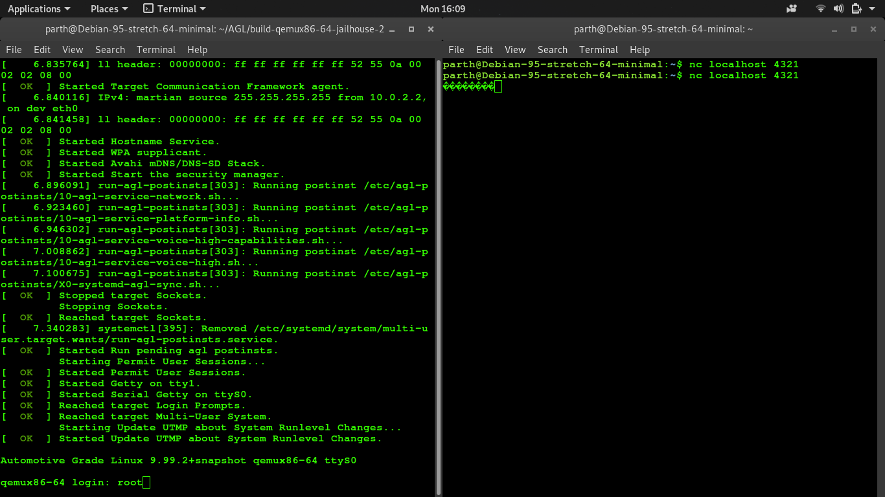

## Inside Qemu

	$ jailhouse hardware check  

	Feature				|Availability
	------------------------------	------------------
	Number of CPUs > 1		|ok
	Long mode			|ok
	x2APIC				|ok
	  VT-x (VMX)			|ok
	  VMX outside SMX		|ok
	  VMX inside SMX		|missing (optional)
	  IA32_TRUE_*_CLTS		ok
	  NMI exiting			ok
	  Preemption timer		ok
	  I/O bitmap			ok
	  MSR bitmap			ok
	  Secondary controls		ok
	  Optional CR3 interception	ok
	  Virtualize APIC access	ok
	  RDTSCP			ok
	 Unrestricted guest		ok
	 INVPCID			missing (optional)
	 XSAVES			ok
	  EPT				ok
	    4-level page walk		ok
	    EPTP write-back		ok
	    2M pages			ok
	    1G pages			missing (optional)
	    INVEPT			ok
	      Single or all-context	ok
	  VM-exit save IA32_PAT		ok
	  VM-exit load IA32_PAT		ok
	  VM-exit save IA32_EFER	ok
	  VM-exit load IA32_EFER	ok
	  VM-entry load IA32_PAT	ok
	  VM-entry load IA32_EFER	ok
	  Activity state HLT		ok

	VT-d (IOMMU #0)			ok
	  39-bit AGAW			ok
	  48-bit AGAW			missing (optional)
	  2M pages			ok
	  1G pages			ok
	  Queued invalidation		ok
	  Interrupt remapping		ok
	  Extended interrupt mode	ok

	Check passed!

	$ jailhouse enable /usr/share/jailhouse/cells/qemu-agl.cell

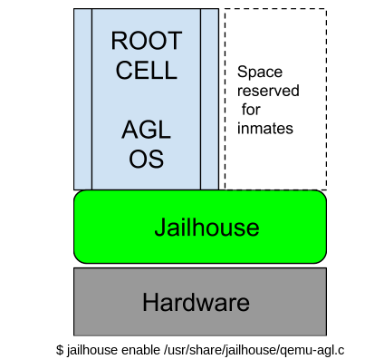

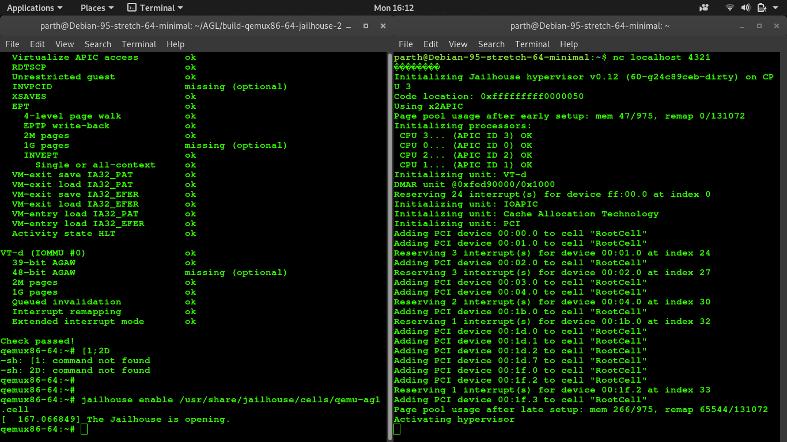

	$ jailhouse cell create /usr/share/jailhouse/cells/agl-apic-demo.cell

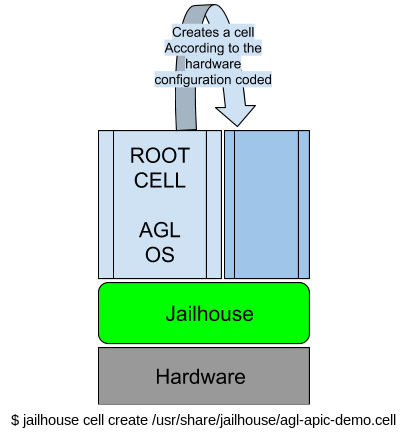

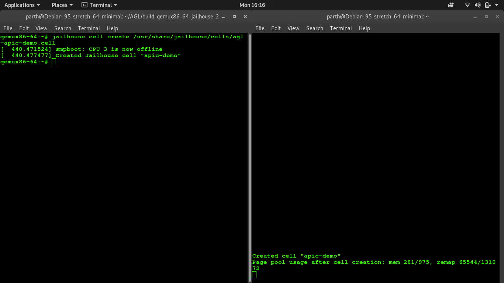

	$ jailhouse cell load apic-demo /usr/share/jailhouse/inmate/apic-demo.bin

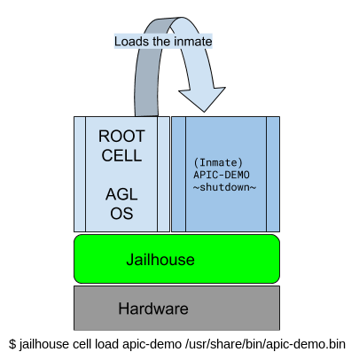

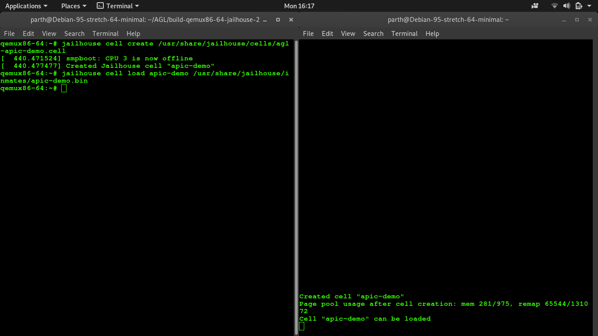

	$ jailhouse cell start apic-demo
	$ jailhouse cell stats apic-demo

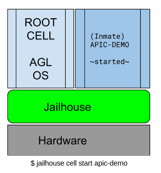

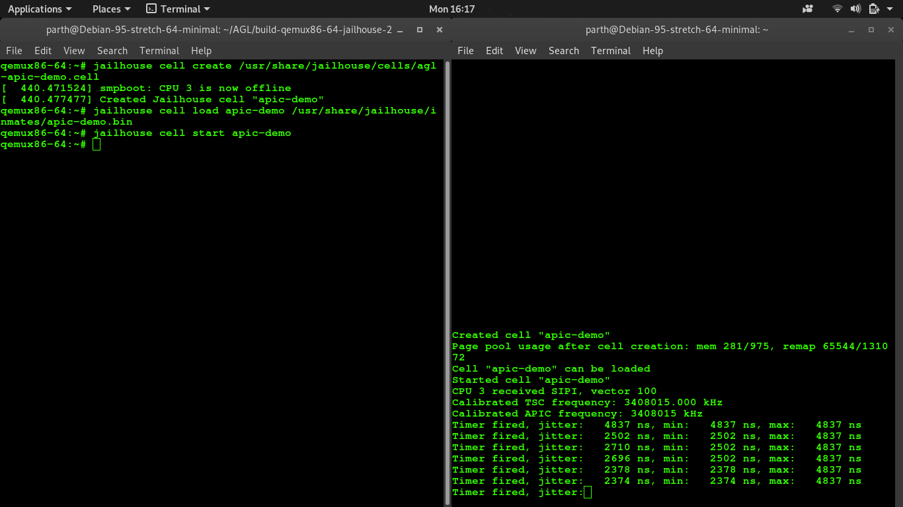

	$ jailhouse cell shutdown apic-demo
	$ jailhouse cell destroy apic-demo

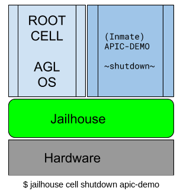
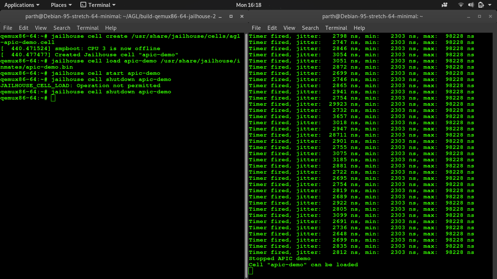
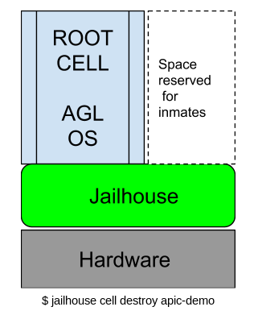
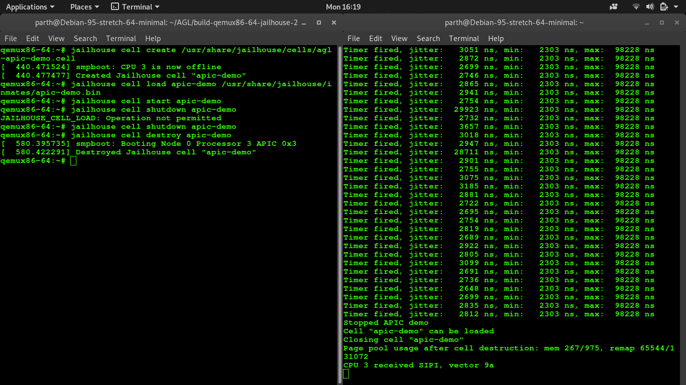
